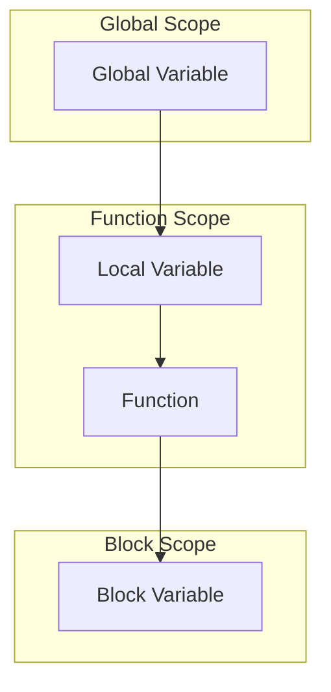

---
tags:
  - bard 
  - scope 
---
# scope: bard version

Sure, here is a summary of JavaScript scope in a table:

| Scope | Description |
|---|---|
| Global scope | The global scope is the outermost scope in a JavaScript program. It is created when the program starts and is destroyed when the program ends. All variables declared at the global scope are accessible from within any function in the program. |
| Function scope | A function scope is created when a function is called. It is a nested scope within the global scope. Variables declared within a function are only accessible from within that function and its child functions. |
| Block scope | A block scope is created when a block of code is enclosed in curly braces {}. It is a nested scope within the function scope in which the block is declared. Variables declared within a block are only accessible from within that block and its child blocks. |

Here are some examples of how scopes work in JavaScript:

```javascript
// Global scope
var myVar = "This is a global variable.";

// Function scope
function myFunction() {
  var myVar = "This is a local variable.";
  console.log(myVar); // This will log "This is a local variable."
}

myFunction(); // This will also log "This is a local variable."

// Block scope
{
  var myVar = "This is a block variable.";
  console.log(myVar); // This will log "This is a block variable."
}

console.log(myVar); // This will not log anything, because myVar is not defined in the global scope.
```

